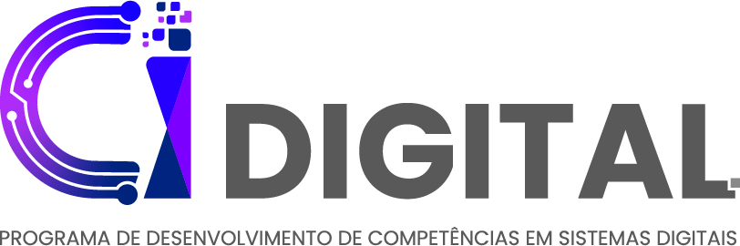

# Programa CI DIGITAL - Polo INATEL
[EN] The CI Digital Program is an initiative of the Ministry of Science, Technology and Innovation (MCTI), in partnership with Softex, aimed at training professionals for the Brazilian semiconductor industry. The program is designed to train up to 350 professionals in the field of microelectronics, with the goal of positioning Brazil as a competent hub for the development of high-complexity, high-value digital integrated circuit projects.

[PT-BR] O Programa CI Digital é uma iniciativa do Ministério de Ciência, Tecnologia e Inovação (MCTI) junto à Softex para capacitação de profissionais para a indústria brasileira de semicondutores. O programa destina-se à capacitação de até 350 profissionais para a área de microeletrônica com intuito de posicionar o país como um centro competente de desenvolvimento de projetos de circuitos integrados digitais de alta complexidade e valor agregado.

## [T25S2] - SD392: Grupo 1

> Descrição

## Componentes / Colaboradores

|       | ESTUDANTE  | FUNÇÃO    |
|:---:  | :---       | :---      |
| 1     |            |           |
| 2     |            |           |
| 3     |            |           |
| 4     |            |           |
| 5     |            |           |
| 6     |            |           |

## Referências

1. ;

2. ; 

3. ; 

4. ; 

5. ; 
