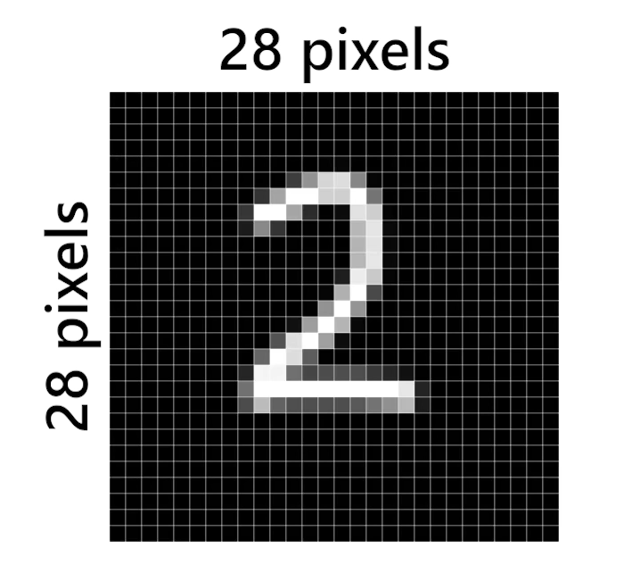
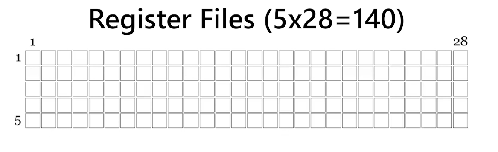
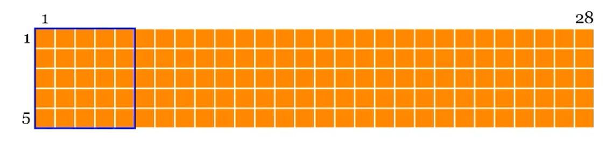
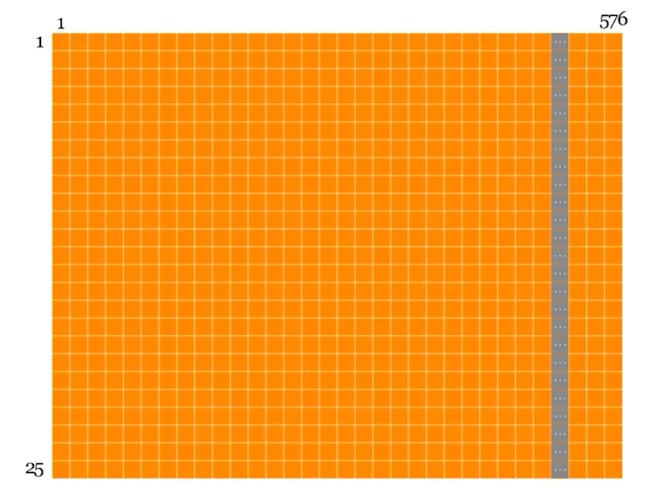

# Implementação RTL

> feito por: Hyago Vieira Lemes Barbosa Sílva
> Líder técnico do G1-CIDigital

## Identificação sobre o modelo e o design RTL

Diversos métodos existem para construção de RTL em rede, como:

   1. **Naive(Direct) Convolution**
   2. Matrix Multiplication
   3. Winograd Convolution
   4. etc...

> Iremos usar o primeiro método mais simples.

## Como iremos armazear a entrada da imagem no Acelerador

1. Possuímos na imagem abaixo de referência, 28x28 pixels = 784 pixels, cada pixel é representado por 8 bits.
2. 784 pixels serão colocados na entrada do acelerador de forma serial, um pixel por ciclo de clock.
3. Começando pelo canto esquerdo superior, padrão da imagem, index (0,0), se movendo para x-> até o limite depois desce 1 unidade de pixel pra y e continua. Isso é chamado de ordem **Raster Scan**

> Porque colocamos a entrada como serial ? Como os dados são inseridos em séria, não há necessidade de uma memória grande, capaz de armazenar toda a imagem, nem de esperar que a imagem completa chegue antes de iniciar o processamento

## Portanto precisamos de algo que armazene esses pixels em FPGA

podemos optar pelos blocos de memória, ou nesse caso, podemos usar os **Register Files**.

Os **Register Files** possuem um comprimento de 8 bits e podem conter cerca de 140 elementos, acomodando 5 linhas de 28 pixels cada. Esse design é intensional, pois o tamanho do kernel é 5. Isso pode demonstrar uma gestão eficiente de memória, dados recursos limitados do FPGA. E pode ser aplicado para outros casos de outros modelos com kernel maior ou menor, e entradas de imagens com outras resoluções.

Este **Register Files** é denominado **Line Buffer**.

> Porque não usamos 28*28 = 784 pixels, de entrada direta para FPGA ? A resposta é que este é um exemplo de otimização do uso da memória, pois a FPGA possui recursos limitados.

Para realizar uma convolução convencional, **Naive Convolution** precisamos ler cada bloco de 5 × 5 pixels da imagem a partir da memória de linha de buffer, depois deslocamos um pixel para direita e repetimos até chegar ao final da linha.

A cada ciclo de clock, 5x5 pixels da saída de dados serão processados. Esse bloco de 5 × 5, ou seja, 25 pixels, será fornecido pelo buffer de linha a cada ciclo de clock para a próxima etapa: o cálculo da convolução.

No total, teremos 24 × 24, ou seja, 576 desses conjuntos de 25 pixels, pois isso corresponde ao tamanho da saída da operação de convolução na primeira camada.
